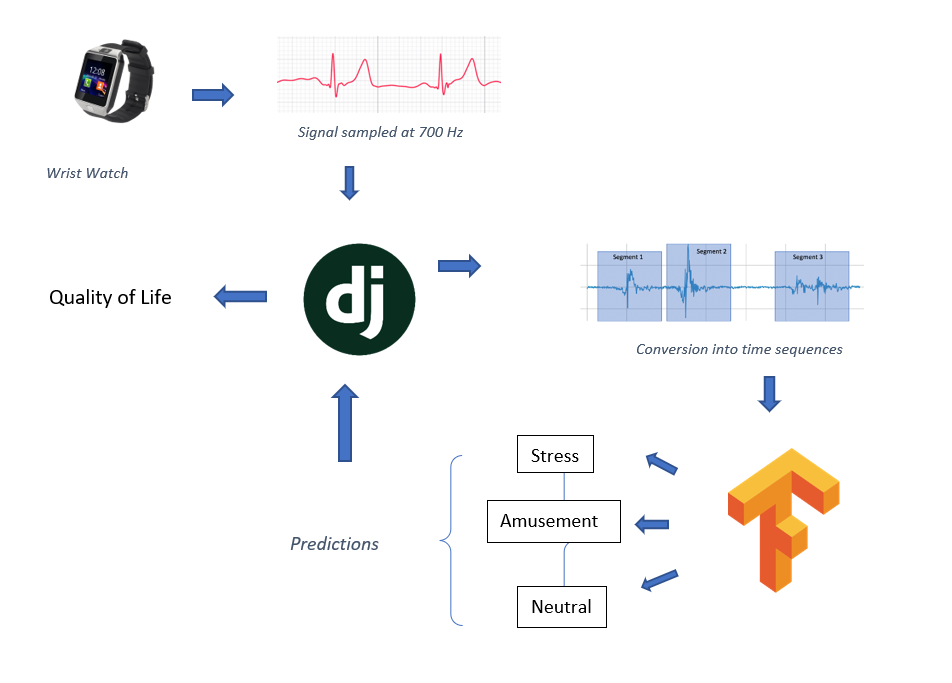

# Stress Detection 

Do you know 77 percent of people experience stress that affects their physical health. 73 percent of people have stress that impacts their mental health. If left unchecked this can have severe consequences.

What if you could monitor your stress from the comfort of your home ? 

## Stress detection using physiological data.

- I have trained a deep learning model on the multimodal WESAD Dataset. ( Details in the ```train_dir``` folder )
- Then I deployed the model to a webapp using Django.
- Thus the users upload their phsyiological data to the Webapp, and django leverages the classifier model to classify their data between 
    1. Stress
    2. Amusement 
    3. Neutral

## The Architecture is shown below - 




## Tech Stack Used 
- Django, Html/CSS 
- Tensorflow, numpy, pandas, sklearn, etc.

# Setup 

- After cloning the repo, create a virtual-environment 
- Create a ```config.json``` file corrosponding to <a href="dummy.json">dummy.json</a> in the ```stress_detection``` folder.

```python
pip install -r requirements.txt
python local.py migrate
python local.py runserver

```
> PS : I use local.py in local environment to maintain a smooth flow, refer to my stackoverflow answer here - https://stackoverflow.com/questions/68766668/django-best-practice-for-running-switching-dev-debug-product-mode/68766902#68766902

# License 

This is a starware ⭐, which means you can use my code as long as you star this repo.