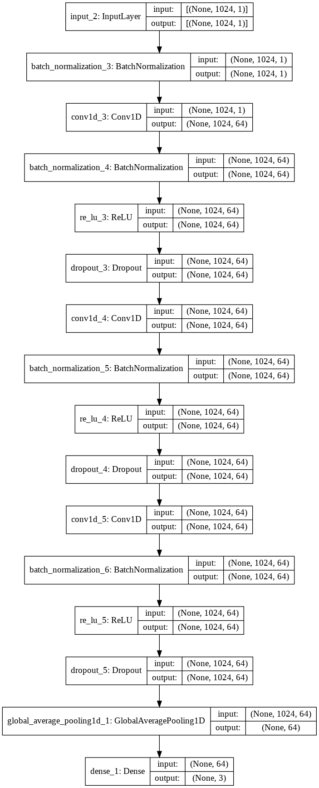

# Training And Testing 

I have Initially cleaned the data in the ```data_cleaning.ipynb``` notebook and then trained a 1-D CNN model on the ``` train_test.ipynb``` notebook. 

After which I have saved all the best models of each modality in the Models Directory.

From there Django Handles the rest. 

## Steps of Machine Learning - 

1. Since every person have varying rate of physiological value, I have initially used MinMaxScalar to normalize them. 
2. Create Sequences of 1024 samples ( 1.4 seconds = (1024/700)) for training and testing. 
3. So the model gives its verdict of a data of 1.4 seconds or 1024 samples ( Sampleing Rate = 700 HZ)
4. Shuffle the Train Sequences. 
5. While feeding the sequences to the model, providing a Batch Normaliztion Layer to normalize the input. 
6. Training the Model with the Architecture shown below. 

The architecture used is the following. 


## Future Scope - 
1. Deeper ML Model 
2. Data Balancing Techniques like smote.